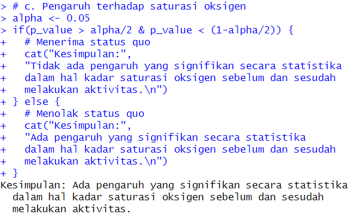

# Praktikum Modul 2 Probstat
Nama : Ghifari Maaliki Syafa Syuhada  
NRP  : 5025211158  
Kelas: C  

### Soal 1
Diketahui :  
X = {78, 75, 67, 77, 70, 72, 78, 70, 77}  
Y = {100, 95, 70, 90, 90, 90, 89, 100, 100}  

a. Standar deviasi selisih X dan Y dapat kita cari dengan peratma mencari selisih dengan mengurangi semua elemen dengan indeks yang sama, lalu mencari standar deviasinya  

b. Dengam menggunakan library 'BSDA', kita dapat menggunakan fungsi `t.test()` untuk menghitung hasil uji T. Diantara output yang dihasilkan `t.test()` adalah T-value dan P-value  

c. Setelah kita mengetahui P-value nya, kita dapat menentukan apakah H1 akan diterima atau tidak. Karena nilai `alpha = 0.05` dan hipotesis merupakan pernyataan iya dan tidak, maka terdapat 2 nilai kiritis yaitu pada `alpha/2` dan `1-alpha/2`. Apabila P-value berada di tengah-tengah kedua nilai kritis tersebut, maka H1 ditolak. Sebaliknya bila meleweati, maka H1 akan diterima.  

> nanti ganti alphanya

### Soal 2
Diketahui :  
mean populasi = 25000
mean sampel = 23500
n = 100
standar deviasi = 3000

a. Untuk mencapai sebuah kesimpulan, pertama-tama kita mesti melakukan perhitungan. Dengan menerapkan uji Z melalui fungsi `zsum.test()` kita dapat memperoleh P-valuenya  

c. Setelah itu, kita dapat melakukan uji hipotesis. Kita tahu hanya ada 1 nilai kritis yaitu `alpha` karena H1 nya mencoba membuktikan untuk rata-rata yang lebih rendah dari status quo. Dapat dilihat bahwa P-valuenya tinggi yaitu `0.9999997`. Dengan P-value setinggi itu, dapat dipastikan bahwa H1 ditolak. Untuk memeriksanya, saya membuat fungsi untuk memeriksa hipotesis yang valid dengan memisalkan `alpha = 0.05`  

### Soal 3
Diketahui :
n Bandung = 20
n Bali = 27
  
mean Bandung = 3.64
mean Bali = 2.79
  
standar deviasi Bandung = 1.67
standar deviasi Bali = 1.5

a. Karena persoalan yang 
