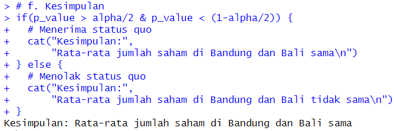

# Praktikum Modul 2 Probstat
Nama : Ghifari Maaliki Syafa Syuhada  
NRP  : 5025211158  
Kelas: C  

### Soal 1
Diketahui :  
X = {78, 75, 67, 77, 70, 72, 78, 70, 77}  
Y = {100, 95, 70, 90, 90, 90, 89, 100, 100}  

a. Standar deviasi selisih X dan Y dapat kita cari dengan peratma mencari selisih dengan mengurangi semua elemen dengan indeks yang sama, lalu mencari standar deviasinya  

b. Dengam menggunakan library 'BSDA', kita dapat menggunakan fungsi `t.test()` untuk menghitung hasil uji T. Diantara output yang dihasilkan `t.test()` adalah T-value dan P-value  

c. Setelah kita mengetahui P-value nya, kita dapat menentukan apakah H1 akan diterima atau tidak. Karena nilai `alpha = 0.05` dan hipotesis merupakan pernyataan iya dan tidak, maka terdapat 2 nilai kiritis yaitu pada `alpha/2` dan `1-alpha/2`. Apabila P-value berada di tengah-tengah kedua nilai kritis tersebut, maka H1 ditolak. Sebaliknya bila melewati, maka H1 akan diterima.  

### Soal 2
Diketahui :  
mean populasi = 25000
mean sampel = 23500
n = 100
standar deviasi = 3000

a. Untuk mencapai sebuah kesimpulan, pertama-tama kita mesti melakukan perhitungan. Dengan menerapkan uji Z melalui fungsi `zsum.test()` kita dapat memperoleh P-valuenya  

c. Setelah itu, kita dapat melakukan uji hipotesis. Kita tahu hanya ada 1 nilai kritis yaitu `alpha` karena H1 nya mencoba membuktikan untuk rata-rata yang lebih rendah dari status quo. Dapat dilihat bahwa P-valuenya tinggi yaitu `0.9999997`. Dengan P-value setinggi itu, dapat dipastikan bahwa H1 ditolak. Untuk memeriksanya, saya membuat fungsi untuk memeriksa hipotesis yang valid dengan memisalkan `alpha = 0.05`  

### Soal 3
Diketahui :  
n Bandung = 20  
n Bali = 27  
  
mean Bandung = 3.64  
mean Bali = 2.79  
  
standar deviasi Bandung = 1.67  
standar deviasi Bali = 1.5  
  
a. Dengan melihat semua yang diketahui, saya menganggap bahwa persoalan ini adalah tentang estimasi parameter dimana kita membandingkan kedua rata-rata dari populasi. Oleh karena itu, maka:
- H0 : Rata-rata jumlah saham di Bandung dan Bali sama
- H1 : Rata-rata jumlah saham di Bandung dan Bali tidak sama  

b. Untuk menghitung sampel statistik kita menerapkan uji t melalui fungsi `tsum.test()`.  

c. Uji statistik menggunakan distribusi t-student dengan `df = 2`  
  
Grafik :  

d. Nilai kritikal kita cari dengan fungsi `qt()` untuk distribusi t. Karena hipotesis berupa pernyataan sama dan tidak sama, maka distribusi two-tailed. Jadi nilai kritikal ada 2 yang akan kita cari dengan memasukkan nilai alpha `1 - alpha/2` yang nantinya akan kita ubah sign nya untuk mendapatkan 2 nilai.  

e. Dari semua informasi yang kita dapat, kita bisa mengambil keputusan apakah kita akan menerima H1 atau tidak  

f. Begitu juga dengan kesimpulan  

### Soal 4
Diketahui :  
- Data berupa file csv

a. Pertama-tama kita baca file csv yang diberikan. Lalu untuk membuat plotting, kita dapat menggunakan fungsi `ggplot()` yang berada di library `ggplot2`
  
Grafik :   

b. Uji ANOVA kita lakukan dengan fungsi `aov`. Sesuai dengan data, variabel `Light` adalah variabel yang dependen dengan `Temp` dan `Glass` yang merupakan variabel independen. Maka penulisannya pada fungsi `aov` adalah `Light ~ Temp * Glass`. Kita dapat melihat outputnya dengan fungsi `summary`  

c. Untuk membuat tabelnya kita dapat menggunakan fungsi `summarize` dan untuk setiap perlakuannya, kita akan menghitung rata-rata dan standar deviasi dari `Light`  

